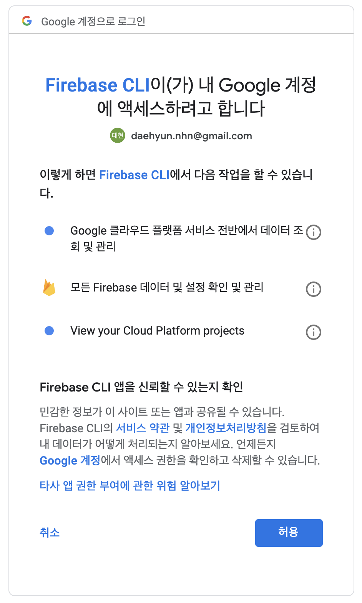
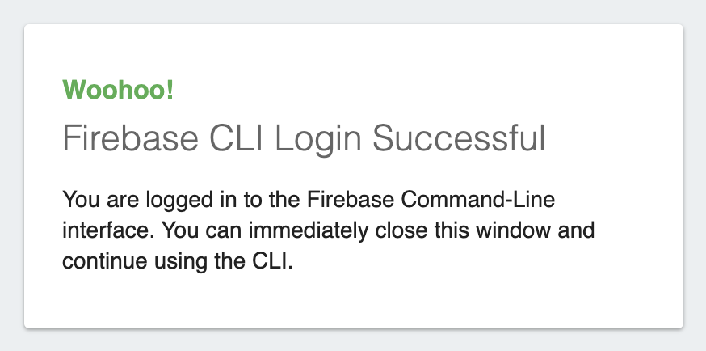
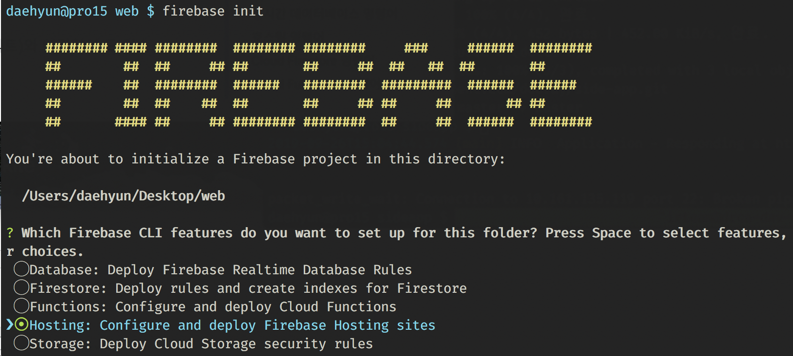
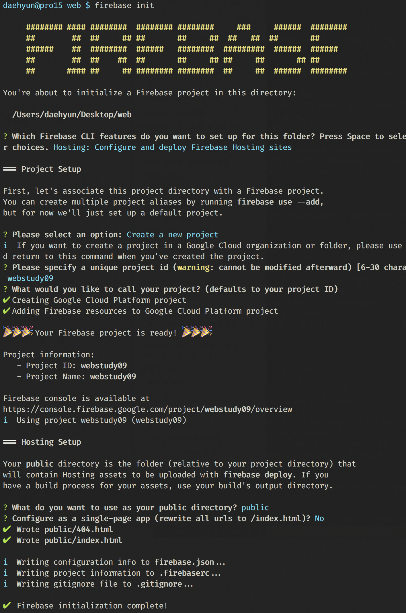

# 웹사이트 제작 스터디 9회 - 수업

## 지난 시간 내용

* HTML에서 CSS 스타일을 적용하는 방법 세 가지.
* CSS 선택자 초중급 - 스타일을 적용할 태그를 고르는 방법.
* CSS 속성 초중급 - 스타일링 이모저모.
* 자바스크립트 맛보기 - 버튼 카운터 붙이기.

## 지난 시간의 자바 스크립트 코드

``` html
<button id="버튼">버튼</button>
<div id="표시">0</div>
<script>
  var 횟수 = 0;
  const 버튼 = document.getElementById('버튼');
  const 표시 = document.getElementById('표시');
  버튼.onclick = function(e) {
    표시.innerText = ++횟수;
  };
</script>
```

* HTML은 화면에 보일 "내용"을 작성
* CSS는 내용을 꾸밀 외양을 정의
* JS는 화면에 보이는 내용 및 외양을 프로그래밍
* 잠시 후에 남는 시간만큼 상세한 설명 들어갑니다.

## 구글 파이어베이스(firebase) 호스팅

* https://firebase.google.com/docs/hosting/
* 구글 계정으로 무료 웹사이트 호스팅
* firebase CLI 툴 설치 필요
* 명령창(터미널)으로 내 웹사이트 배포

### Firebase 설치

* https://firebase.google.com/docs/cli
* (맥) [node.js](https://nodejs.org/en/) 설치 선행
* [(윈도우) 독립 실행 바이너리 설치](https://github.com/abehaskins/firepit/releases/latest)
* 설치했다면, 맥은 터미널 앱, 윈도우는 명령 프롬프트(CMD) 실행.
* `cd` 명령어로 바탕화면 웹 디렉터리로 이동.

``` bash
$ npm install -g firebase-tools
/usr/local/bin/firebase -> /usr/local/lib/node_modules/firebase-tools/lib/bin/firebase.js
+ firebase-tools@7.4.0
added 413 packages from 254 contributors in 10.19s

```

### Firebase 로그인

``` bash
$ firebase login
i  Firebase optionally collects CLI usage and error reporting information to help improve our products. Data is collected in accordance with Google's privacy policy (https://policies.google.com/privacy) and is not used to identify you.

? Allow Firebase to collect CLI usage and error reporting information? No

Visit this URL on this device to log in:
https://accounts.google.com/o/oauth2/auth?client_id=563584335869-fgrhgmd47bqnekij5i8b5pr03ho849e6.apps.googleusercontent.com&scope=email%20openid%20https%3A%2F%2Fwww.googleapis.com%2Fauth%2Fcloudplatformprojects.readonly%20https%3A%2F%2Fwww.googleapis.com%2Fauth%2Ffirebase%20https%3A%2F%2Fwww.googleapis.com%2Fauth%2Fcloud-platform&response_type=code&state=1017418979&redirect_uri=http%3A%2F%2Flocalhost%3A9005

Waiting for authentication...

✔  Success! Logged in as daehyun.nhn@gmail.com
```

* 웹브라우저에서 로그인 후 인증



* 인증 후 화면



### Firebase 프로젝트 목록

``` bash
$ firebase projects:list
✔ Preparing the list of your Firebase projects
┌──────────────────────┬───────────────┬──────────────────────┐
│ Project Display Name │ Project ID    │ Resource Location ID │
├──────────────────────┼───────────────┼──────────────────────┤
│ website-study        │ website-study │ [Not specified]      │
└──────────────────────┴───────────────┴──────────────────────┘

1 project(s) total.
```

* 만든 프로젝트가 있다면 위 화면이 나와야...
* (없다면) 새로 만듭시다.

### Firebase (호스팅) 프로젝트 생성



* 호스팅 프로젝트 초기화




### Firebase 호스팅, 첫 배포.

* 내 웹사이트가 온라인에 공개됐다.
* 스마트폰으로 접속해보자.
* 친구들에게 URL을 알려줘 보자.

## 자바스크립트

### 명령형 프로그래밍

* 어떤 값을 어디에서 읽어서, 계산하고, 새 값을 어딘가에 쓴다.
* 이전 상태에서 새로운 상태로 바뀐다.
* 순서가 중요하며, 어디까지 진행했는지 시점도 중요하다.

### 변수

* 특정 값을 읽거나 쓸 수 있는 (메모리) 공간
* 특정 시점에 항상 어떤 값을 갖고 있다.

``` javascript
x = 2;
y = 3;
z = x + y;
```

* 값 -  숫자, 문자열, 유니코드, 함수 등 고정된 값
* 함수도 값이라는 게 좀 어려울 수 있다. 아니 함수 자체가 어렵다.

### 대입 연산자

* 수학의 등식과 다르다. (예. x = x + 1)
* 좌측 변수에, 우측 식의 평가 값을 저장한다.
* 이전의 값은 사라지고, 새 값이 그 변수를 차지한다.

### 객체(오브젝트, object)

* 자바스크립트의 객체란?
* 어떤 여러 변수를 한꺼번에 담고 있는 묶음 변수
* 읽기만 하고 쓸 수 없는 변수(속성)도 들어 있고, 읽고 쓸 수 있는 속성도 담고 있다.
* 지난시간에 보인, `document.getElementById(...)`의 `document`가 객체이다.

### 함수

* 함수는 어떤 값을 주면, 새로운 값을 돌려주는 사상(mapping). 뭔가를 계산해서 결괏값을 준다.

## 요약

* 자바스크립트 설명 조금 더
* 파이어베이스 툴 설치와 첫 배포
* 자바스크립트 기초 탄탄 설명

## 다음 시간

* (목) 개천절 모각공 없음.
* 다음 주 (화) 수업
